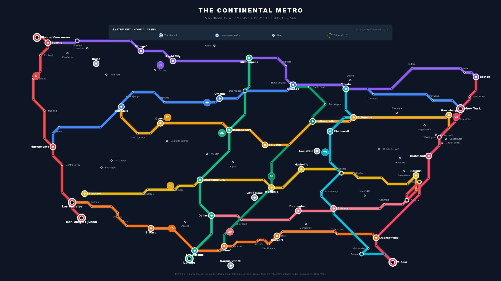
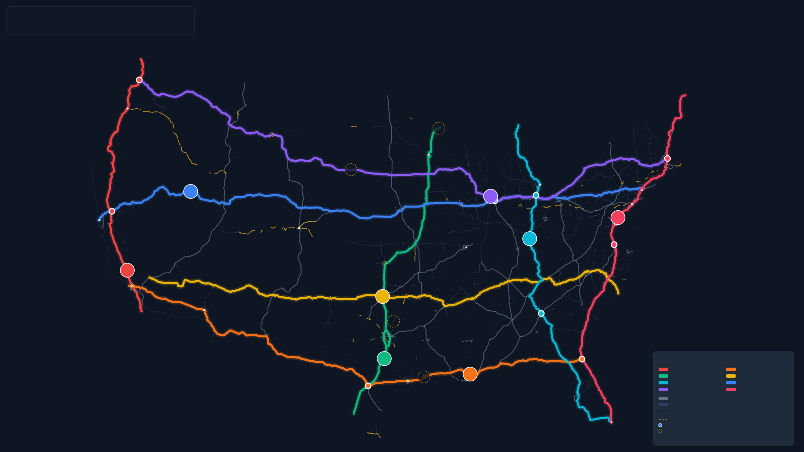
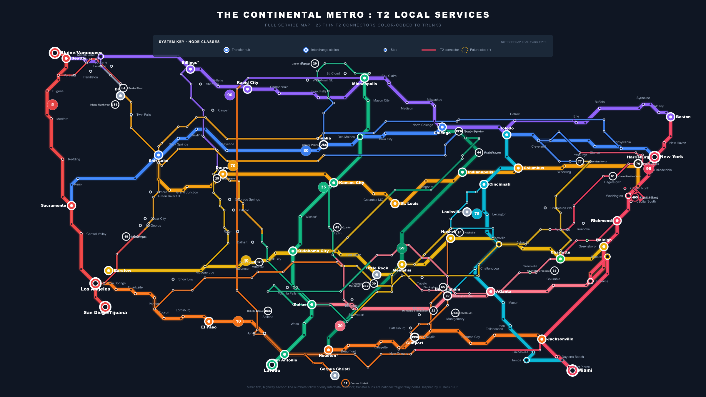
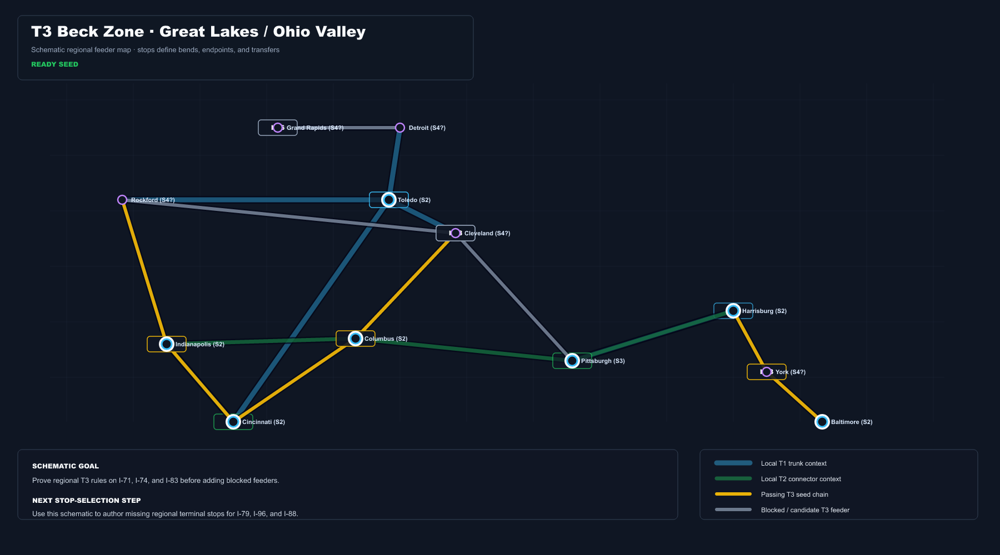
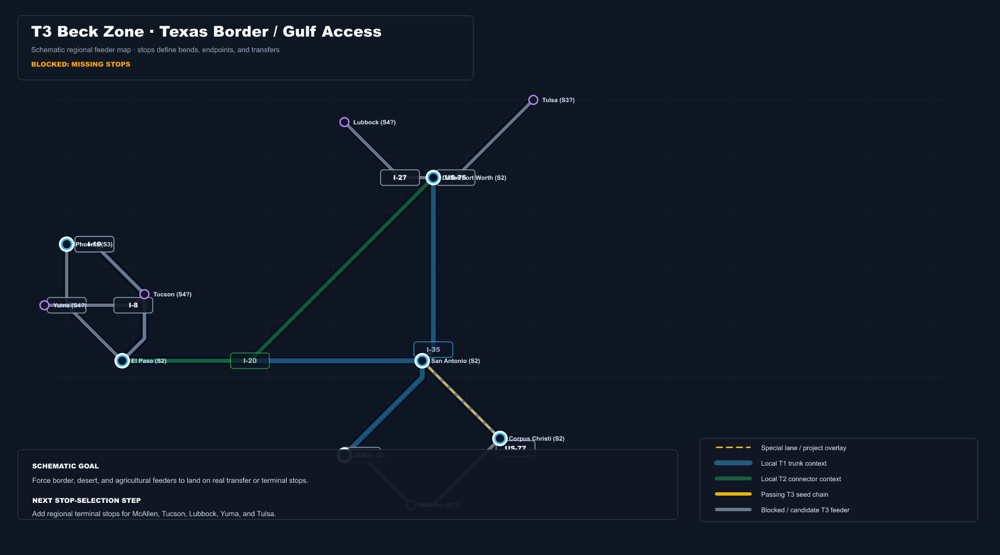
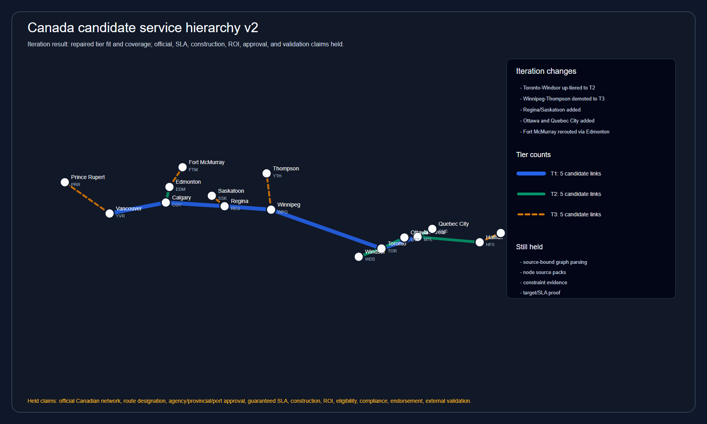
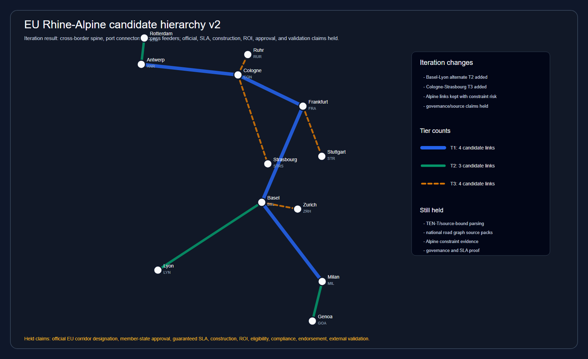
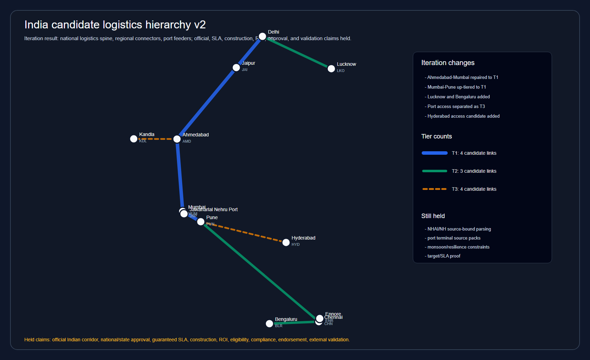

# ROUTE — Interstate 2.0

The United States already chose highways. ROUTE asks what the next version of
the national road system should promise.

Today, most interstates are treated like one flat category: an interstate is an
interstate is an interstate. That blurs priorities. A coast-to-coast freight
spine, a regional connector, a rural feeder, a port approach, and a warehouse
access road do not have the same job.

ROUTE gives roads the kind of service hierarchy rail and metro systems already
use: express spine, regional connector, feeder, terminal access. It turns
Interstate 2.0 from a road list into a promise network.

## Media resources

If you are reporting on ROUTE or Interstate 2.0, start with
[`docs/media/README.md`](docs/media/README.md). The media materials include a
fact sheet, claim guide, evidence posture, and source pointers.

Important boundary: ROUTE is a research and tooling project. The current
materials do not claim official-plan status, construction readiness, guaranteed
service, numeric ROI, eligibility, compliance, agency endorsement, or public
deployment readiness.

Repository visibility makes the research inspectable; it does not promote held
maps, scenarios, estimates, or recommendations beyond their recorded evidence
labels.



## The core idea

Interstate 2.0 should be planned around service promises:

| Tier | Promise | Job |
|---|---|---|
| **T1** | 48h / 36h | National timed-freight spine for coast-to-coast and half-continent service. |
| **T2** | 24h / 12h | Regional connector and relief layer that feeds T1 and links mega-regions. |
| **T3** | 6h | Feeder and access mesh for production zones, ports, smaller metros, and rural regions. |
| **T4** | 1h | Terminal, port, rail-yard, warehouse, border, and last-mile freight access. |

That changes the planning question:

```text
not:  Which road should be upgraded?
but:  What should the national network promise, and what investments make that promise credible?
```

## The problem ROUTE is built to solve

The existing system has strengths, but it is not organized as a national service
platform:

- gridlock at ports, metros, mountain passes, and interchanges can break freight
  reliability;
- resilience is local and fragmented instead of designed as national redundancy;
- freight lanes, relay hubs, rest/charging facilities, and intermodal access are
  inconsistent;
- EV charging and autonomous freight have no coherent road-network deployment
  structure;
- states and industries bring valid requirements, but the plan rarely gets
  refined visibly around those requirements.

ROUTE is the planning engine for that problem. It turns public goals,
stakeholder requirements, funding constraints, freight needs, rural access,
resilience, and regional politics into a plan that can be refined rather than
argued as a static map.

## What ROUTE has already built

ROUTE is not just a concept deck. It is a Rust analysis workspace, generated map
system, research program, review process, and game/simulation path.

| Capability | What it does |
|---|---|
| **Service maps** | Generates national and regional schematic maps from selected route/stop/service artifacts. |
| **SLA promise portfolio** | Uses timed freight promises to shape T1/T2/T3/T4 instead of route fame or visual convenience. |
| **Recursive optimizer** | Moves from T1 spine to T2 regions to T3/T4 access zones, then bubbles infeasible lower-tier pressure back upward. |
| **Bundle identity** | Treats bundles as the service/corridor object; route labels are presentation attributes, not stable identity. |
| **Stop-first SLA graph** | Keeps visible stops, route services, service classes, schematic geometry, and SLA promises aligned. |
| **Research tracks** | Covers scoring, gap analysis, freight reliability, max-flow, 48-hour economy, resilience, Interstate 2.0 design, transit, and relay. |
| **Role review** | Uses parliament, stakeholder, editorial, and panel-review lanes so tradeoffs are visible instead of hidden behind one score. |
| **Interstate Tycoon** | Turns the same network into a playable strategy layer where infrastructure choices have visible consequences. |

## Maps are part of the product

ROUTE maps are not screenshots. They are generated artifacts tied to service
doctrine, diagnostics, ledgers, and publication scope.



The T2 layer is especially important: it is not a national list of decorative
thin lines. T2 is a regional service treatment solved inside the T1 graph.



T3 and T4 make the national system usable by regions, production zones, ports,
border areas, terminals, warehouses, smaller metros, and rural communities.

| Regional access view | Border / production access view |
|---|---|
|  |  |

Current map posture: structural maps can be used to explain the system, but
publication-grade claims remain scoped by
[`docs/map-publication-scope.md`](docs/map-publication-scope.md). A map can be
render-valid without proving every SLA, transit, upgrade, terminal-access, or
asset-condition claim.

## International portability

ROUTE also tests whether the same source-to-corpus-to-tier-to-map workflow can
travel across jurisdictions without pretending that US assumptions are
universal.

| Canada | Rhine–Alpine | India |
|--------|---------------|-------|
| [](maps/international/canada-candidate-hierarchy-v2.png) | [](maps/international/eu-rhine-alpine-candidate-hierarchy-v2.png) | [](maps/international/india-candidate-hierarchy-v2.png) |

Additional review fixtures:
[Japan Pacific Belt](maps/international/japan-candidate-hierarchy-v2.png) and
[China logistics spine](maps/international/china-candidate-hierarchy-v2.png).

These are candidate hierarchy and workflow-portability fixtures, not official
networks. Route designation, local source acceptance, guaranteed SLA,
construction, ROI, approval, endorsement, and external validation remain held.
See the
[international portability report](docs/reports/international-network-inference-portability-report.md)
for the evidence boundary and reusable proof-kernel sequence.

## T1: where the country buys reliability

T1 is the national promise spine. It is where 48h/36h freight commitments drive
the biggest choices:

- managed freight lanes where service windows justify the investment;
- interchange fixes where bottlenecks can break national movement;
- resilience and alternate routes for closures, weather, mountain passes, ports,
  and shocks;
- pavement, bridge, rest, parking, and charging standards that support the tier;
- relay hubs that make timed freight operational instead of aspirational.

T1 is not "the longest roads." A T1 route earns its place because it helps meet
a national promise horizon or has an explicit resilience, relay, market, or
topology justification.

## T2/T3/T4: where the system becomes usable

T2, T3, and T4 are not leftovers.

- **T2** creates regional 24h/12h service, connector logic, relief value, and
  real contacts to the T1 spine.
- **T3** turns regional feeder access into 6h service zones with local T1/T2
  context.
- **T4** handles the places where freight actually begins and ends: terminals,
  gates, yards, warehouses, border crossings, and local freight districts.

The recursion matters. If T3/T4 access cannot attach cleanly, ROUTE records the
repair witness and can push pressure back up into T2 or T1. That makes the plan
refinable: requirements change the network instead of becoming unread comments.

## Relay hubs: the aviation model for freight

Pilots do not fly coast to coast without crew bases, duty rules, handoffs,
maintenance systems, and hub operations. Premium long-haul freight can evolve
the same way.

ROUTE's relay concept treats hubs as scheduled operating points:

- professional relay drivers can work regional shifts and return home;
- carriers and shippers can use advance arrival windows for load matching;
- EV charging, battery support, and heavy-duty maintenance can live at known
  nodes;
- autonomous trunk segments can phase in later between staffed hubs;
- states get job centers and infrastructure nodes they can explain.

This is the future-facing Interstate 2.0 story: not only better pavement, but a
national operating system for freight.

## The research backbone

ROUTE has a paper/review system behind the product story. The research tracks
feed the public narrative and the optimizer:

| Track | Purpose |
|---|---|
| A — Corpus & Scoring | Validate the measurement instrument and tier structure. |
| B — Gap Analysis | Identify missing links, bottlenecks, resilience holes, T1/T1 intersections, and port connectors. |
| C — Freight & Throughput | Analyze OD reliability, national max-flow, 48-hour freight, and relay economics. |
| D — Resilience | Price climate and incident exposure. |
| E — Interstate 2.0 Design | Synthesize managed lanes, hubs, hardening, investment sequencing, and standards. |
| F — Transit + Relay | Show how hubs support shared facilities, passenger access, relay markets, and future operations. |

See `research/publications/` for papers and panel-review records.

## The technical system

The implementation is a Rust workspace with clear crate boundaries:

| Crate | Owns |
|---|---|
| `route-data` | Source fetching, parsing, manifests, source-specific records. |
| `route-network` | Graph construction, joins, bundle membership, stable segment identity, coverage, flow, centrality, investment primitives. |
| `route-score` | Scoring bundles and corridor compatibility. |
| `route-map` | Geographic and schematic rendering from selected bundles, members, stops, and stitch groups. |
| `route-sim` | Incidents, traffic assignment, relay, SLA, and OD simulation. |
| `route-report` | Corpus/report generation over bundle identities. |
| `route-cli` | Command orchestration and artifact gates. |

The architecture invariant is:

> Bundles are the core service abstraction. Segment ids are stable physical
> members. Route labels are presentation attributes.

Read [`docs/route-architecture.md`](docs/route-architecture.md) and
[`docs/tier-optimizer-design.md`](docs/tier-optimizer-design.md) before changing
identity, optimizer, map, game, or generated-artifact behavior.

## Review and truth labels

ROUTE is ambitious, but it does not treat ambition as proof. Public claims use
truth/evidence labels such as implemented, heuristic, planned, held,
source-needed, or confidence-limited.

The `.roles/` panel is part of the system:

- parliament roles protect national defense, throughput, equity, freight
  economics, traffic engineering, climate resilience, rural access, optimization,
  and schematic truth;
- stakeholder roles represent state DOTs, freight, rural users, local officials,
  transit-dependent travelers, environmental communities, and more;
- editorial roles check scope, citations, and numeracy before validation;
- panel reviewers review research papers.

No voice is skipped. A good corridor, standard, or claim survives tension; a weak
one produces a useful hold, downgrade, or next evidence step.

## Where to start

| Need | Start here |
|---|---|
| Big-picture operating model | [`docs/SYSTEM_PLAN.md`](docs/SYSTEM_PLAN.md) |
| Current active goal | [`GOAL.md`](GOAL.md) |
| Claim ownership / spec map | [`docs/SPEC_INDEX.md`](docs/SPEC_INDEX.md) |
| Service promise doctrine | [`docs/sla-promise-portfolio.md`](docs/sla-promise-portfolio.md) |
| Bundle-first architecture | [`docs/route-architecture.md`](docs/route-architecture.md) |
| Recursive optimizer | [`docs/tier-optimizer-design.md`](docs/tier-optimizer-design.md) |
| T2 regional doctrine | [`docs/t2-regional-treatment.md`](docs/t2-regional-treatment.md) |
| T3/T4 access doctrine | [`docs/t3-t4-access-optimization.md`](docs/t3-t4-access-optimization.md) |
| Research conclusions index | [`docs/research-conclusions.md`](docs/research-conclusions.md) |
| Interstate 2.0 doctrine report | [`docs/reports/interstate-2-0-doctrine-report.md`](docs/reports/interstate-2-0-doctrine-report.md) |
| Relay hubs report | [`docs/reports/relay-hubs-aviation-model-report.md`](docs/reports/relay-hubs-aviation-model-report.md) |
| 48-hour freight promise report | [`docs/reports/forty-eight-hour-freight-promise-report.md`](docs/reports/forty-eight-hour-freight-promise-report.md) |
| Political value brief | [`docs/briefs/political-value-brief.md`](docs/briefs/political-value-brief.md) |
| State value brief | [`docs/briefs/state-value-brief.md`](docs/briefs/state-value-brief.md) |
| Industry value brief | [`docs/briefs/industry-value-brief.md`](docs/briefs/industry-value-brief.md) |
| Funder value brief | [`docs/briefs/funder-value-brief.md`](docs/briefs/funder-value-brief.md) |
| Evidence posture report | [`docs/reports/route-evidence-posture.md`](docs/reports/route-evidence-posture.md) |
| Communications role review | [`docs/reviews/communications-role-review.md`](docs/reviews/communications-role-review.md) |
| Requirement-to-refinement demo | [`docs/how-to/run-route-demo.md`](docs/how-to/run-route-demo.md) |
| Map publication scope | [`docs/map-publication-scope.md`](docs/map-publication-scope.md) |
| ROI/cost evidence contract | [`docs/reports/route-roi-cost-framework.md`](docs/reports/route-roi-cost-framework.md) |
| Game-facing layer | [`docs/INTERSTATE_TYCOON.md`](docs/INTERSTATE_TYCOON.md) |
| VTRACE package | [`docs/vtrace/MISSION.md`](docs/vtrace/MISSION.md) |
| Interstate 2.0 solution pitch | [`docs/decks/interstate-2-0-pitch.md`](docs/decks/interstate-2-0-pitch.md) |
| ROUTE technology deck | [`docs/decks/route-technology-story.md`](docs/decks/route-technology-story.md) |
| Split deck presenter guide | [`docs/decks/split-deck-presenter-guide.md`](docs/decks/split-deck-presenter-guide.md) |

## Validation

For docs-only changes:

```powershell
git diff --check -- README.md docs
```

For full repo confidence, use the repo-local command profile in
[`docs/vtrace/VERIFICATION.md`](docs/vtrace/VERIFICATION.md). L2 browser/game
validation currently has a known local Playwright tooling risk recorded in the
VTRACE evidence ledger.

## License

[MIT](LICENSE) — © 2026 Gio Della-Libera.
