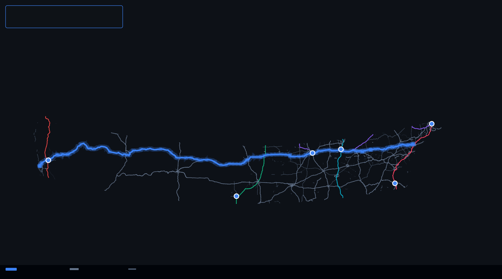
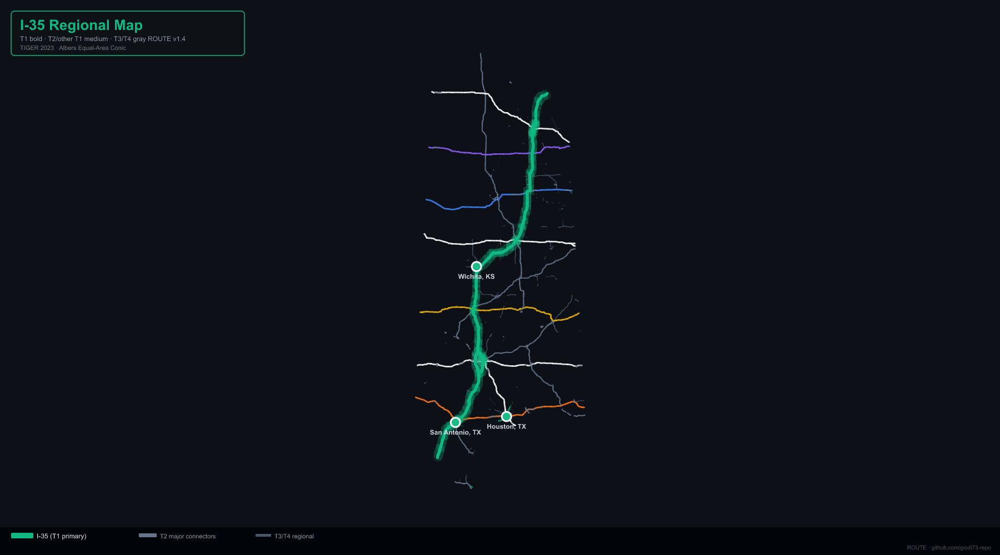
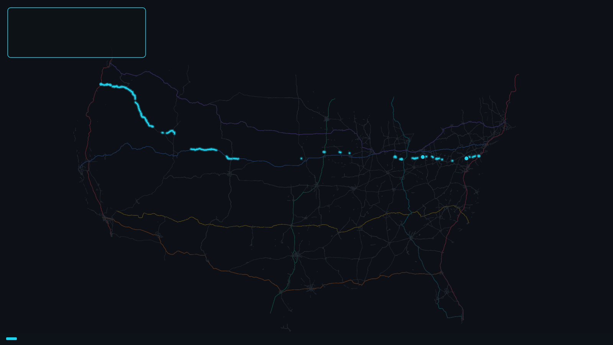
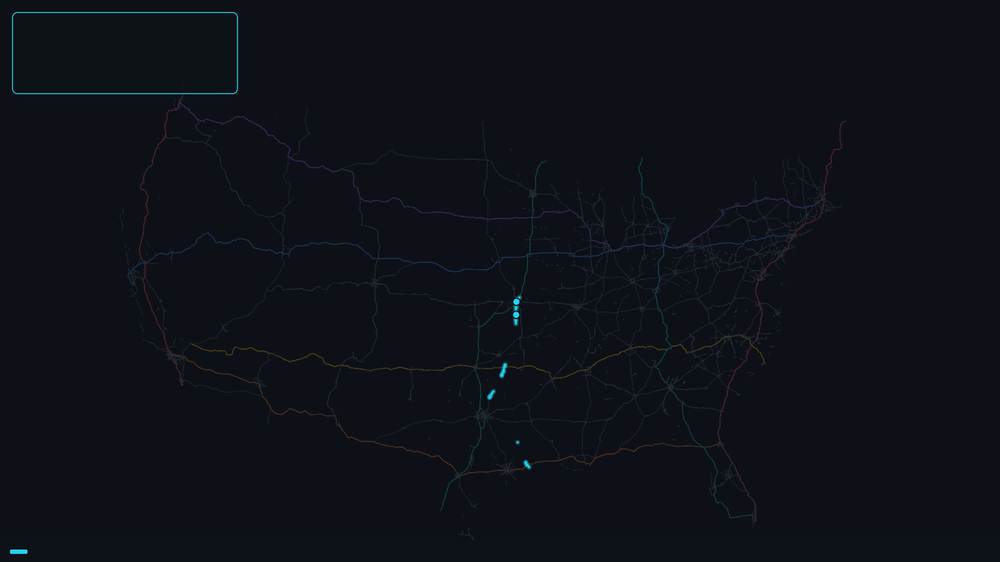
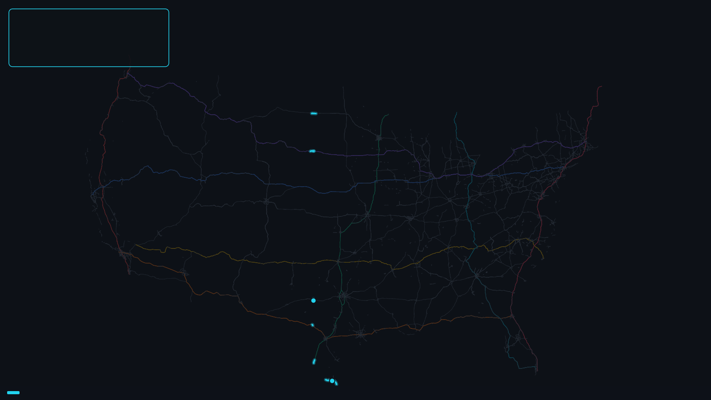

<!--
Title: Iowa Service Network Pitch
Slug: iowa-service-network-pitch
Kind: deck
Status: draft
Truth label: concept / evidence-bounded. Client-facing state service-network
pitch with official-plan, legal-SLA, construction, funding, ROI, clearance,
validation, endorsement, and public-readiness claims held.
Sources:
  - docs/briefs/iowa-state-service-network-goals.md
  - docs/briefs/iowa-state-service-network-offer.md
  - docs/briefs/iowa-service-network-discovery-workshop.md
  - docs/briefs/state-value-brief.md
-->

<!-- _class: title -->

  
Iowa service-network diagnostic

  <h1>Iowa already has roads. What should they promise?</h1>
  
ROUTE helps Iowa turn top cities, rural production, terminals, hospitals, campuses, and failures into a service hierarchy and 90-day diagnostic package.

  
  
Map level: structural route view. Use for service discussion only; not proof of official plan, legal SLA, construction, funding, ROI, or validation.

---

## The opening question

  

    <h3>Traditional question</h3>
    
Which roads are on the map?

    
That discussion quickly becomes route labels, project lists, and local priority fights.

  

  

    <h3>ROUTE question</h3>
    
What must the system deliver?

    
The conversation moves to service roles, unacceptable failures, and what evidence is needed next.

  

The first meeting is about Iowa's priorities, not approval of a finished map.

---

## The offer

  

    <h3>Name the places</h3>
    
Top cities, regional centers, freight nodes, hospitals, campuses, airports, terminals, and production regions.

  

  

    <h3>Name the failures</h3>
    
Flood, snow, work-zone, bridge, incident, detour, interchange, terminal, and rural access failures.

  

  

    <h3>Name the first package</h3>
    
Operations, asset fixes, terminal access, rural access, resilience hardening, or long-range capital questions.

  

ROUTE turns those answers into a service network Iowa can refine.

---

## Service roles for Iowa

  

    
T1

    
State spine

    
Top Iowa city pairs and national gateways with the strongest reliability target.

  

  

    
T2

    
Regional connectors

    
Secondary cities, campuses, hospitals, job centers, and cross-state links.

  

  

    
T3

    
Rural production

    
Agriculture, energy, manufacturing, county-seat, and rural hospital access.

  

  

    
T4 / R

    
Terminals + resilience

    
Airports, river terminals, rail yards, industrial parks, detours, and recovery overlays.

  

---

## Iowa starter views

  

    
    <h3>I-80</h3>
    
Candidate statewide and national-gateway spine discussion.

  

  

    
    <h3>I-35</h3>
    
North-south spine, metro access, and interchange resilience discussion.

  

  

    
    <h3>US 30</h3>
    
Regional connector and state-system redundancy discussion.

  

  

    
    <h3>US 69</h3>
    
Rural and regional access prompt, not a promotion claim.

  

  

    
    <h3>US 83</h3>
    
Cross-state structural example for rural access comparison.

  

  

    
    <h3>Service hierarchy</h3>
    
Use the map as a structural surface, never as proof.

  

---

## The 90-day package

  
<b>1. Intake</b>Places, failures, source owners, and political constraints.

  
<b>2. Tier design</b>Draft T1/T2/T3/T4/R service hierarchy.

  
<b>3. Promise menu</b>Candidate reliability, access, recovery, and terminal targets.

  
<b>4. Resilience</b>Critical failures, alternates, and recovery target menu.

  
<b>5. Packaging</b>Operations, asset, access, resilience, and capital sequence.

  
<b>6. Dashboard</b>Executive measures for the promise after adoption.

Ninety days should produce better decisions, not pretend adoption.

---

## What leaders get

  
<h3>Clear story</h3>
A service promise for Iowa's people, economy, regions, and gateways.

  
<h3>Practical sequence</h3>
Operational fixes, asset fixes, access packages, resilience, and capital options separated.

  
<h3>Better tradeoffs</h3>
Tiers and promise labels show what gets priority and why.

  
<h3>Resilience posture</h3>
Unacceptable failures and backup expectations are named before crisis.

  
<h3>Rural visibility</h3>
Production and emergency access do not disappear behind traffic-volume-only logic.

  
<h3>Management view</h3>
Dashboard questions are designed before adoption.

---

## What this is not

  
<h3>Not an official DOT plan</h3>
No route designation, endorsement, approval, validation, or public-readiness claim.

  
<h3>Not a legal SLA</h3>
Service targets are planning promises until ownership, funding, operating rules, and review close.

  
<h3>Not construction or ROI proof</h3>
No funding commitment, environmental clearance, right-of-way clearance, construction program, or numeric ROI.

ROUTE asks Iowa to define the service network it wants to evaluate.

---

## The first meeting

<table>
  <thead><tr><th>Question</th><th>ROUTE output</th></tr></thead>
  <tbody>
    <tr><td>Which places must stay connected?</td><td>Priority place list and first-pass service hierarchy.</td></tr>
    <tr><td>Which movements deserve the strongest promise?</td><td>Candidate T1/T2/T3/T4 roles and promise backlog.</td></tr>
    <tr><td>Which failures would be unacceptable?</td><td>Resilience stressor list and recovery-target menu.</td></tr>
    <tr><td>Which bottlenecks limit the promise?</td><td>Access, terminal, interchange, bridge, incident, and local-constraint backlog.</td></tr>
    <tr><td>Which package should move first?</td><td>30/60/90-day action list and candidate investment sequence.</td></tr>
  </tbody>
</table>

---

## Close

  
<h3>Bring priorities</h3>
Cities, regions, freight nodes, rural access, terminals, hospitals, campuses, and failures.

  
<h3>Bring owners</h3>
Planning, operations, freight, rural/access, local/MPO, and finance/program voices.

  
<h3>Bring boundaries</h3>
What Iowa cannot claim yet and what evidence would change that.

Start with one decision: what places in Iowa must stay connected?

---

<!-- _class: title -->

  
ROUTE

  <h1>Iowa can buy a better decision process before buying a bigger project.</h1>
  
ROUTE turns the first answer into a service hierarchy, promise backlog, resilience agenda, investment sequence, and dashboard questions.

  
  
Map level: structural route view. Excluded claims: official plan, legal SLA, construction readiness, funding, ROI, validation, public readiness.

