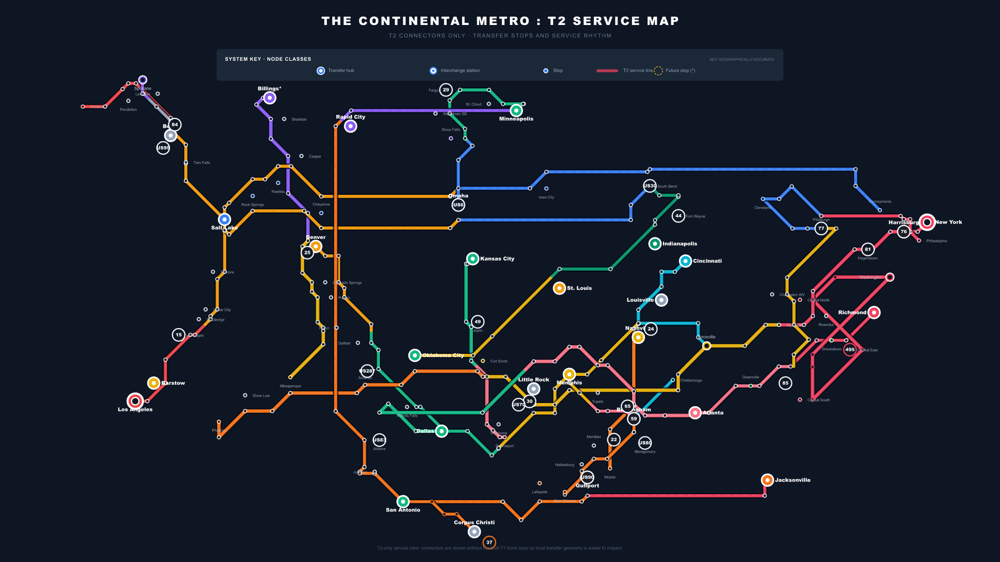

<!--
Status: draft
Kind: deck
Owner: route-comms

Truth label: concept. This deck sells the ROUTE / Interstate 2.0 vision for
politicians, funders, states, and industry. It does not claim final corridor
rankings, official endorsement, construction readiness, or ROI values.
-->

<!-- _class: title -->

# Interstate 2.0 should be a promise, not a map.

ROUTE turns national ambition into a plan states, industry, and funders can refine together.

---

<!-- _class: title -->

# America built the first interstate system for another era.

**The next one has to solve freight reliability, rural access, resilience, electrification, automation, and regional growth.**

---

## The problem politicians recognize

  

    <h3>Gridlock</h3>
    
Ports, metros, mountain passes, and interchanges can break national freight reliability.

  

  
The system has no national service standard

  

    <h3>No organized resiliency</h3>
    
Closures and shocks are handled locally, not as a designed national redundancy system.

  

  

    <h3>Inconsistent freight lanes</h3>
    
Freight priority appears corridor by corridor instead of as a national operating layer.

  

  

    <h3>Future tech has nowhere to land</h3>
    
EV charging, autonomous trunking, relay labor, and hubs need planned nodes.

  

ROUTE gives politicians, states, and industry the same planning language.

---

## The answer: a national service promise ladder

  

    
T1

    
48h / 36h

    
National timed-freight spine

  

  

    
T2

    
24h / 12h

    
Regional connector layer

  

  

    
T3

    
6h

    
Feeder and access mesh

  

  

    
T4

    
1h

    
Terminal and last-mile access

  

The question changes: what should the network promise?

---

## Roads need the hierarchy rail already has

  

    <h3>Today: one flat category</h3>
    
Interstates are mostly treated as the same kind of asset. That makes the
    country argue route by route instead of by service role.

    

      
Interstate = Interstate = Interstate

      
Same label, different national value

      
Priorities blur together

    

  

  

    <h3>ROUTE: a service network</h3>
    
Rail, metro, and transit systems already use hierarchy: express,
    regional, feeder, terminal. ROUTE applies that logic to roads.

    

      
T1 national spine — 48h / 36h

      
T2 regional connectors — 24h / 12h

      
T3 feeder access — 6h

      
T4 terminal access — 1h

    

  

---

## T1: the national promise spine

  

    

      <h3>Roadway needs</h3>
      
Surface, safety, capacity, and reliability work where the national promise depends on it.

    

    

      <h3>Managed lanes</h3>
      
Premium freight lanes where service windows justify the investment.

    

  

  

48h / 36h national service

  

    

      <h3>Interchange fixes</h3>
      
Targeted bottleneck and junction repairs before giant corridor spending.

    

    

      <h3>Resilience + multiple routes</h3>
      
Redundancy for closures, weather, mountain passes, ports, and national shocks.

    

  

T1 is where the country buys reliability.

---

## The maps make the promise visible

  

    
  

  

    <h3>From highway map to service map</h3>
    

      ROUTE has already built national schematic maps that make Interstate 2.0
      legible: trunks, connectors, stops, transfers, and service layers can be
      shown like a metro system for freight and access.
    

    

      Use them as the visual centerpiece: the promise is visible before the
      investment package is final.
    

  

---

## T2: the regional engine

  

    
  

  

    
<strong>24h / 12h service:</strong> regional freight promises that feed the T1 spine.

    
<strong>Real contacts:</strong> routes must connect to meaningful system nodes, not just pass nearby.

    
<strong>Relief value:</strong> T2 can carry resilience, bypass, port, and border value when T1 is stressed.

    
<strong>Demotion discipline:</strong> useful routes can fall to T3/T4 instead of cluttering the regional map.

  

---

## One system, multiple views

  

    
    <h3>National tier picture</h3>
    
Shows the system as a layered national service network.

  

  

    
    <h3>Regional connector view</h3>
    
Inspect regional service without the national trunk dominating the story.

  

  

    
    <h3>Regional access view</h3>
    
Turns feeder obligations into something a region can discuss.

  

  

    
    <h3>Border and production access</h3>
    
Connects industry, agriculture, border flow, and access.

  

---

## ROUTE is the refinement engine

  
Public goal

  
→

  
Requirement

  
→

  
Model change

  
→

  
Plan refinement

  
→

  
Staged option

  
<h3>Freight reliability</h3>
Re-rank corridors, hubs, relays, and bottlenecks around service windows.

  
<h3>Rural access</h3>
Keep agricultural and smaller-market access visible when metro volume dominates.

  
<h3>Funding window</h3>
Break the vision into pilots, studies, hubs, upgrades, and corridor packages.

---

## What states get

  

    <h3>A national case</h3>
    
State priorities become part of a national freight, access, resilience, and competitiveness story.

  

  

    <h3>A refinement loop</h3>
    
State objections can change the plan instead of being handled after the announcement.

  

  

    <h3>A staged ask</h3>
    
Planning, hubs, charging, safety, pavement, and corridor upgrades can be funded in practical steps.

  

**Not Washington handing states a finished map. A way for states to shape the national plan.**

---

## What industry gets

  

    <h3>Freight reliability</h3>
    
Timed promises make service quality concrete for shippers, carriers, ports, and warehouses.

  

  

    <h3>Operational nodes</h3>
    
Relay hubs, charging depots, transfer points, and maintenance bases become planned infrastructure.

  

  

    <h3>A voice in requirements</h3>
    
Industry pain points can become route, stop, staging, and investment refinements.

  

---

## Relay hubs: the aviation model for freight

Pilots use crew bases, duty rules, handoffs, maintenance systems, and hub operations.

Premium freight can evolve the same way.

  
<strong>Crew base</strong>Regional shifts and professional freight chauffeurs.

  
<strong>Charge + service</strong>Known EV, maintenance, and staging nodes.

  
<strong>Handoff point</strong>Scheduled load, driver, and future AV transfers.

  
<strong>State asset</strong>Jobs, hubs, and explainable infrastructure packages.

---

## Why the relay layer matters

  

    <h3>Human today</h3>
    
Regional relay shifts can improve driver quality of life and widen the labor pool.

  

  

    <h3>Electric next</h3>
    
Heavy-duty charging and maintenance can live at predictable relay nodes.

  

  

    <h3>Autonomous later</h3>
    
Driverless trunk segments can phase in between staffed hubs when rules and technology allow.

  

  
Plan hubs

  
Pilot service + charging

  
Automate trunk segments

---

## The policy backbone already exists

| Paper track | Plain-English role in the story |
|---|---|
| Freight reliability | Why predictable windows matter to shippers and carriers. |
| National max-flow | Where the system binds or fails under stress. |
| 48-hour economy | Why fast highway freight changes the market for high-value goods. |
| Empty backhaul / relay | Why hubs can improve utilization and scheduling. |
| Interstate 2.0 framework | How managed lanes, missing links, resilience, charging, and transit fit together. |
| Relay marketplace | How the operating model can mature toward EV and autonomous freight. |

---

## ROI without fake numbers

  

    <h3>Value stack</h3>
    <ul>
      <li>freight reliability</li>
      <li>bottleneck relief</li>
      <li>resilience recovery</li>
      <li>rural + production access</li>
      <li>driver workforce quality</li>
      <li>EV / AV readiness</li>
    </ul>
  

  

    <h3>Cost stack</h3>
    <ul>
      <li>planning + evidence</li>
      <li>right-of-way + delivery</li>
      <li>capital construction</li>
      <li>operations + maintenance</li>
      <li>technology + controls</li>
      <li>community mitigation</li>
    </ul>
  

  

    <h3>The rule</h3>
    
No ROI claim until sources, price year, uncertainty, exclusions, and review lanes are visible.

  

---

## The win-win

  
<h3>States</h3>
A stronger case for nationally relevant projects.

  
<h3>Industry</h3>
Better service windows and a place to put operational requirements.

  
<h3>Funders</h3>
Staged packages instead of a single impossible mega-ask.

  
<h3>Drivers</h3>
A premium regional career path, not just punishing long-haul work.

  
<h3>Communities</h3>
Concerns enter the plan early, before positions harden.

  
<h3>Technology</h3>
A real deployment corridor for EV and autonomous freight.

---

## What we are asking for now

  

    <h3>Story package</h3>
    
Decks, one-pagers, state views, industry views, and public visuals.

  

  

    <h3>Decision package</h3>
    
Research conclusions, service promise ladder, and staged investment logic.

  

  

    <h3>Demo package</h3>
    
Show a requirement entering the system and changing the plan.

  

Fund the story, decision, and demo package so ROUTE becomes legible to leaders.

---

<!-- _class: title -->

# Interstate 2.0 is the vision.

**ROUTE is how the vision becomes a plan people can fund, refine, and believe in.**
