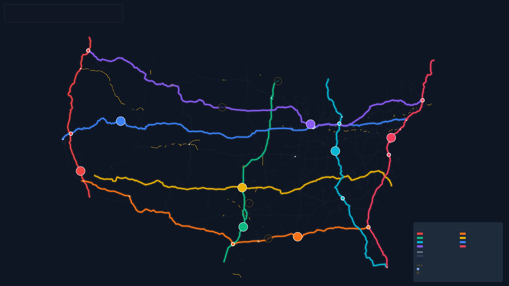

<!--
Status: draft
Kind: deck
Owner: route-comms

Truth label: sales-ready / evidence-bounded. This deck sells the ROUTE state
service-network diagnostic, DCR expansion path, and Texas paid-pilot pathway.
It does not claim
TxDOT endorsement, official-plan status, legal SLA readiness, construction
readiness, numeric ROI, procurement readiness, validation, public readiness, or
source-backed full inventory.
-->

<!-- _class: title -->

  
ROUTE state service-network diagnostic

  <h1>Sell the network job, not another road map.</h1>
  
ROUTE turns a state or authority's priorities into a service hierarchy, failure ledger, evidence boundary, and paid pilot path.

  
  
Map level: structural. Excluded claims: official plan, legal SLA, construction readiness, numeric ROI, validation, public readiness.

---

## The buyer already has maps

  

    <h3>Maps show ownership</h3>
    
They rarely say what each link must do for the state's economy, resilience, and access promises.

  

  

    <h3>Project lists show demand</h3>
    
They blur operations, asset repair, access, resilience, terminal, and capital decisions together.

  

  

    <h3>Dashboards show symptoms</h3>
    
They often miss the service promise that makes a failure unacceptable.

  

ROUTE adds the missing layer: role, promise, failure, evidence, and next decision.

---

## What ROUTE sells

  

    
T1

    
Statewide trunk

    
Top city, gateway, and economic spine promises.

  

  

    
T2

    
Regional connector

    
Market, relief, and regional access roles.

  

  

    
T3

    
Rural mesh

    
Production, healthcare, small-market, and continuity needs.

  

  

    
T4 / R / M / X

    
Access and discipline

    
Terminal access, resilience overlay, maintenance-only, and explicit non-promotion.

  

The product is not promotion. It is full-system role assignment with evidence holds.

---

## The state product has a real workflow

  
<b>1. Intake</b>Top places, failures, source owners, and claim boundaries.

  
<b>2. Payload</b>Segments, nodes, failures, terminals, and non-promotion rows.

  
<b>3. Custody</b>Source identity, row traceability, scope labels, review disposition.

  
<b>4. Fit</b>Candidate T1/T2/T3/T4/R/M/X roles for the pilot scope.

  
<b>5. Review</b>Client owner marks each role pass, hold, or fail.

  
<b>6. Readout</b>Executive story, failure modes, evidence gaps, next package.

Every step can stop cleanly instead of overclaiming.

---

## Texas proves the sale path

  

    
01

    <h3>Buyer review</h3>
    
Go/no-go memo, agenda, source request, and safe answers for a sponsor conversation.

  

  

    
02

    <h3>Paid pilot scope</h3>
    
Phases, deliverables, acceptance gates, and non-fit responses.

  

  

    
03

    <h3>Kickoff readiness</h3>
    
Sponsor, scope, source owners, data handling, review cadence, and claim boundary before start.

  

Texas is now a sales motion, not just a sample map.

---

## What the buyer receives

  
<h3>Pilot scope sheet</h3>
What is in, what is out, who owns sources, and which claims stay held.

  
<h3>Source custody ledger</h3>
Which rows support analysis, which rows are source-needed, and why.

  
<h3>Candidate hierarchy</h3>
T1/T2/T3/T4/R/M/X candidate roles for the scoped network.

  
<h3>Failure-mode scorecard</h3>
Closure, restriction, bottleneck, terminal, recovery, and access gaps.

  
<h3>Investment question backlog</h3>
Studies, pilots, operations, access, asset, and capital questions grouped by role.

  
<h3>Executive readout</h3>
A leadership story that names evidence boundaries instead of hiding them.

---

## The future UI makes it a working session

  

    <h2>Clients should edit the network live.</h2>
    
Preload the state, show candidate roles, expose held claims, then let the buyer add places, change tiers, adjust dials, and export a bounded readout.

    
This turns ROUTE from report delivery into a planning workbench.

  

  

    
Texas Service Networkevidence: source-needed

    

      

        
Dallas-Fort Worth

        
Houston / Gulf

        
Border gateways

        
Energy regions

        
Rural access

      

      

      

        <b>Reliability</b>

        <b>Freight priority</b>

        <b>Rural access</b>

        <b>Resilience</b>

      

    

  

---

## DCR turns the package into operations

  

    <h3>Monitor the promise</h3>
    
Track reliability, incidents, closures, assets, terminal access, EV charging stress, and evidence drift.

  

  

    <h3>Simulate the switch</h3>
    
Replay closure, weather, EV range, signage, detour, terminal, and package scenarios before committing.

  

  

    <h3>Export the decision</h3>
    
Produce claim-safe readouts for reroute, signage, EV support, recovery, access, asset, or investment posture.

  

DCR is the recurring product: the Decision Control Room for the service network.

---

## What DCR decides

<table>
  <thead><tr><th>Decision</th><th>Trigger</th><th>Output</th></tr></thead>
  <tbody>
    <tr><td>Reroute</td><td>Closure, degradation, restriction, shared hazard</td><td>Preferred alternate and blocked alternates</td></tr>
    <tr><td>Signage</td><td>Drivers need earlier route, charge, or detour choice</td><td>Message intent, location theme, and timing</td></tr>
    <tr><td>EV support</td><td>Charger outage, detour length, weather range loss</td><td>EV-sensitive path and staging/support note</td></tr>
    <tr><td>Recovery</td><td>Incident duration exceeds target window</td><td>Escalation, staging, and communication posture</td></tr>
    <tr><td>Investment</td><td>Recurring monitored failures outrank old sequence</td><td>Re-ranked operations, asset, access, resilience, or capital package</td></tr>
  </tbody>
</table>

ROUTE recommends and documents. The operator retains authority.

---

## The kickoff gate protects the buyer

  

    <h3>Do not start until this is true</h3>
    
Sponsor, scope, source owners, data handling, review cadence, and claim boundary are confirmed.

  

  

    
<h3>Workshop only</h3>
Interest exists, but source owners or scope are missing.

    
<h3>Procurement hold</h3>
Buyer needs price quote, contracting, or purchasing artifacts first.

    
<h3>Source hold</h3>
Payloads or custody metadata cannot support source-backed fit yet.

    
<h3>Claim hold</h3>
Buyer wants official, SLA, ROI, construction, validation, approval, or public claims too early.

  

---

## Safe answers to hard buyer questions

| Question | Answer |
|---|---|
| Is this a DOT plan? | No. It is a diagnostic review packet until an authorized external review says otherwise. |
| Can we use the hierarchy publicly? | Not from this packet. Public-readiness stays held until release review and claim approval. |
| Does this guarantee service? | No. The pilot defines candidate promises and evidence gaps; legal SLA claims remain held. |
| Will this produce ROI? | It can define the ROI evidence contract; numeric ROI remains held. |
| Is this a construction recommendation? | No. It structures next studies, pilots, and decision packages. |

---

## Why this is valuable even before a full inventory

  
<h3>It exposes missing owners</h3>
States learn which source surfaces block stronger claims.

  
<h3>It separates service from politics</h3>
The discussion moves from "my road" to "what job does this link perform?"

  
<h3>It prevents fake certainty</h3>
Unsupported official, SLA, ROI, construction, approval, and validation claims stay held.

The first paid product is a better decision process.

---

## The first close

  
<h3>Pick the pilot scope</h3>
State, authority, corridor, port region, gateway, or freight coalition.

  
<h3>Name source owners</h3>
Segment inventory, priority nodes, failure evidence, terminal access, non-promotion, claim boundary.

  
<h3>Choose the path</h3>
Diagnostic first, DCR tabletop, 30-90 day DCR pilot, or workshop-only hold.

Start with a bounded service-network diagnostic, then keep it alive with DCR.

---

<!-- _class: title -->

  
ROUTE

  <h1>The state sells itself when the network job is visible.</h1>
  
ROUTE gives a buyer the service hierarchy, evidence discipline, and kickoff gate needed to start without pretending the plan is finished.

  
  
Map level: structural regional view. Use for service discussion only; not proof of official route status, terminal readiness, SLA, ROI, or construction.

